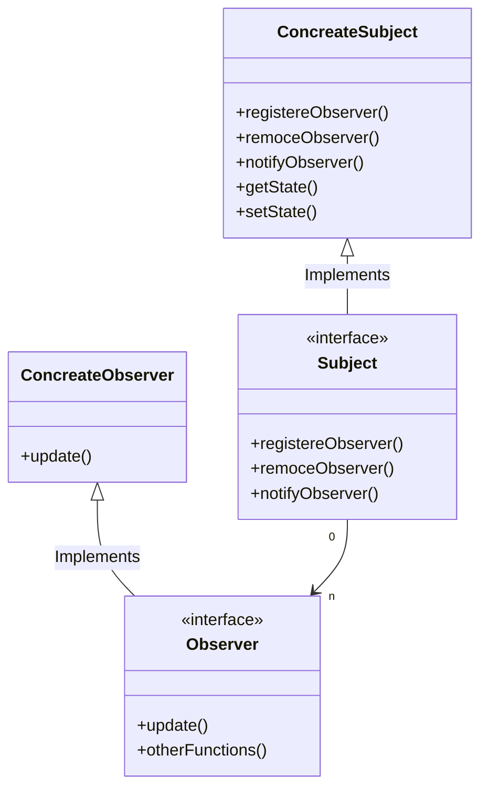
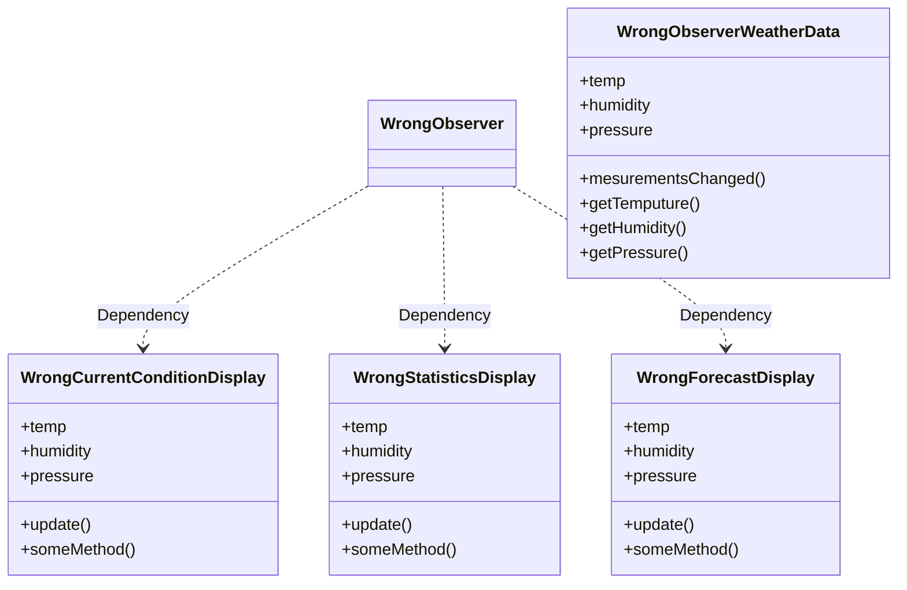
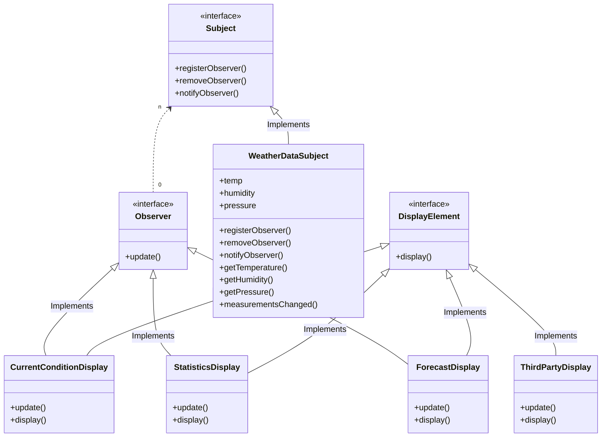

# Observer Pattern

> The observer pattern is a software design pattern in which an object, named the subject, maintains a list of its dependents, called observers, and notifies them automatically of any state changes, usually by calling one of their methods.
> https://en.wikipedia.org/wiki/Observer_pattern

新聞の定期購読のイメージ（publisher / subscriber の関係）

# Observer のクラス図

# 例

気象データの表示アプリケーション

気温、湿度、気圧の測定値を表示する。

新しい気象観測データを取得するたびに書くデータが更新される。

将来的には 3 つ以外の表示もでてくる予想。

## よくある間違い設計

- WrongObserverWeatherData が具象実装に対して依存しているため、コードのを変更せずに他の表示要素の追加、削除ができない。

## Observer にした例

・サブジェクトはオブザーバーがある特定のインターフェースを実装しているということだけ知っている。

・オブザーバーの追加/削除はリストの更新だけで良い

└ 新しいオブザーバーの具象クラスが現れた際に、サブジェクトクラスを変更する必要がなくなる。新しい具象クラスが、インターフェースを実装し、オブザーバーとして登録するだけ。

