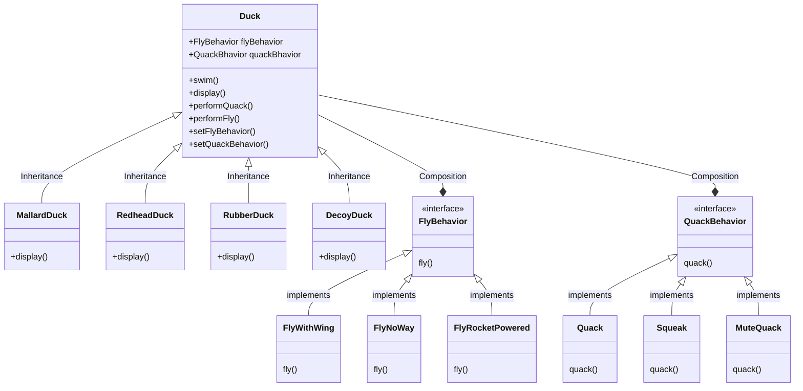

# Strategy Pattern

> strategy pattern (also known as the policy pattern) is a behavioral software design pattern that enables selecting an algorithm at runtime.
> https://en.wikipedia.org/wiki/Strategy_pattern

Requirements

- FlyRocketPowered is a new implementation by specification changed

