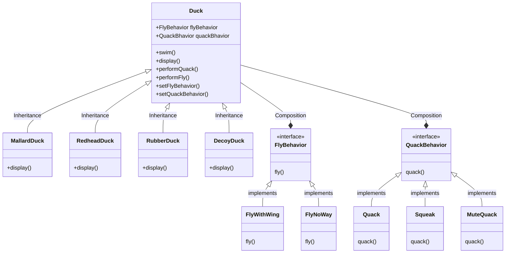

# Strategy Pattern

```mermaid
classDiagram

    class Duck {
        +FlyBehavior flyBehavior
        +QuackBhavior quackBhavior
        +swim()
        +display()
        +performQuack()
        +performFly()
        +setFlyBehavior()
        +setQuackBehavior()
    }

    class MallardDuck {
        +display()
    }
    class RedheadDuck {
        +display()
    }
    class RubberDuck {
        +display()
    }
    class DecoyDuck {
        +display()
    }
    Duck <|-- MallardDuck : Inheritance
    Duck <|-- RedheadDuck : Inheritance
    Duck <|-- RubberDuck : Inheritance
    Duck <|-- DecoyDuck : Inheritance
    Duck --* FlyBehavior : Composition
    Duck --* QuackBehavior : Composition

    class FlyBehavior {
        <<interface>>
        fly()
    }
    class FlyWithWing {
        fly()
    }
    class FlyNoWay {
        fly()
    }
    FlyBehavior <|-- FlyWithWing : implements
    FlyBehavior <|-- FlyNoWay : implements

    class QuackBehavior {
        <<interface>>
        quack()
    }
    class Quack {
        quack()
    }
    class Squeak {
        quack()
    }
    class MuteQuack {
        quack()
    }
    QuackBehavior <|-- Quack : implements
    QuackBehavior <|-- Squeak : implements
    QuackBehavior <|-- MuteQuack : implements


```
