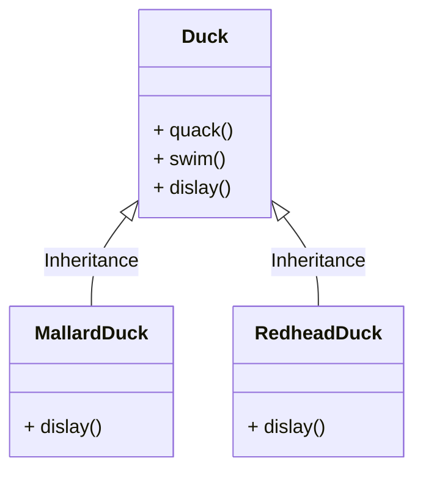
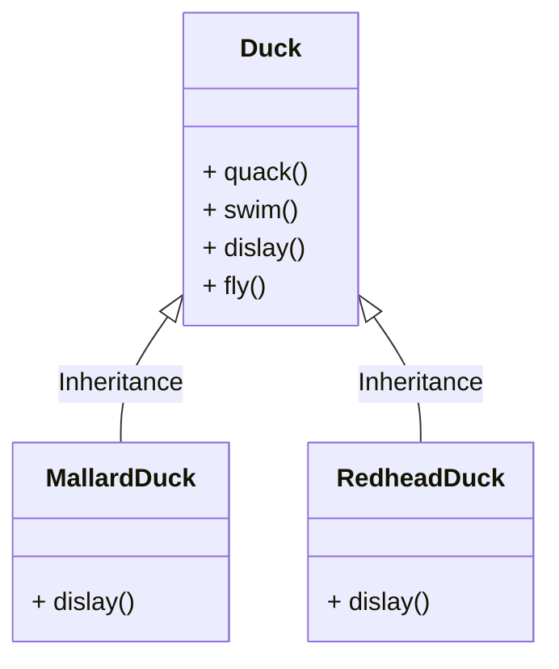
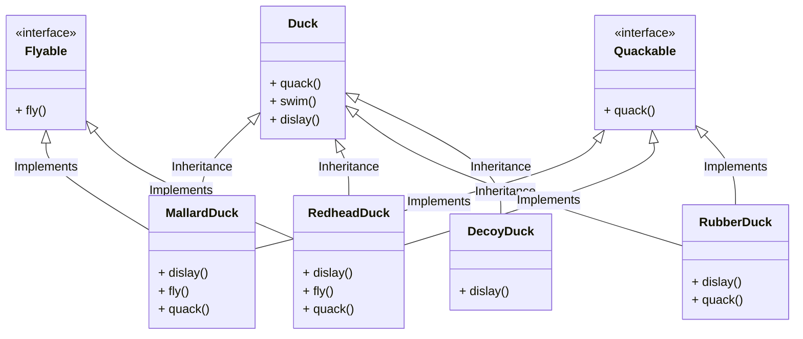
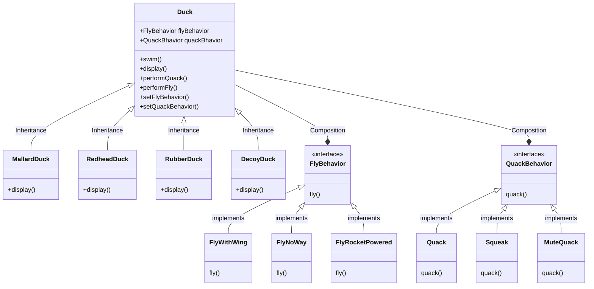

# Strategy Pattern

> strategy pattern (also known as the policy pattern) is a behavioral software design pattern that enables selecting an algorithm at runtime.
> https://en.wikipedia.org/wiki/Strategy_pattern

カモのシミュレーションゲーム

カモを表示、カモは泳ぐ、泣くなどの機能がある

通常のあるある設計

競合に勝つために飛ぶアヒルを加える決断をした。

すべてのアヒルが飛んでしまう問題が発生した。（飛ばないアヒルもいる仕様）

インターフェイスだと各クラスに独自の実装をもつ必要があり、保守的な観点で必要以上の変更量となってしまう。

↓ strategy パターン

